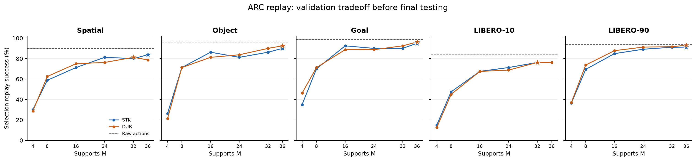

# LIBERO STK and DUR replay — 21 September 2026

**10/10 mode/suite searches complete.** These are demonstration-codec replay
results, not trained-policy benchmark scores. Each mode uses its own frozen
validation choice; final episodes never retune R/D/M.

| Suite | Mode | R (degrees) | D (m) | M | Selection ARC / raw | Final ARC / raw | Final gap (pp) |
|---|---|---:|---:|---:|---|---|---:|
| Spatial | stk | 96 | 1.6 | 36 | 67 / 72 (n=80) | 139 / 142 (n=150) | -2.00 |
| Spatial | dur | 128 | 0.8 | 32 | 65 / 72 (n=80) | 131 / 142 (n=150) | -7.33 |
| Object | stk | 48 | 1.6 | 36 | 72 / 77 (n=80) | 137 / 139 (n=150) | -1.33 |
| Object | dur | 48 | 0.8 | 36 | 74 / 77 (n=80) | 136 / 139 (n=150) | -2.00 |
| Goal | stk | 192 | 1.6 | 36 | 76 / 79 (n=80) | 133 / 143 (n=150) | -6.67 |
| Goal | dur | 192 | 1.6 | 36 | 77 / 79 (n=80) | 135 / 143 (n=150) | -5.33 |
| LIBERO-10 | stk | 128 | 1.6 | 32 | 61 / 67 (n=80) | 108 / 125 (n=150) | -11.33 |
| LIBERO-10 | dur | 192 | 0.8 | 32 | 61 / 67 (n=80) | 113 / 125 (n=150) | -8.00 |
| LIBERO-90 | stk | 128 | 0.8 | 36 | 657 / 678 (n=720) | 1223 / 1265 (n=1350) | -3.11 |
| LIBERO-90 | dur | 128 | 1.6 | 36 | 670 / 678 (n=720) | 1231 / 1265 (n=1350) | -2.52 |

R caps accumulated rotation; D caps accumulated translation. STK stores
interval velocities, while DUR stores interval seconds. Both have separate
translation and rotation clocks. M includes the initial support.

The grid contains 336 R/D/M settings per mode and suite. Coverage below 99%
screens a candidate out before simulator calibration on demos 0–1. The best
calibrated R/D at each M advances to selection on demos 2–9. Selection ranks
success first, then fewer supports, then command MSE. The frozen winner is
tested on demos 35–49. These are splits of recorded demonstrations; policy
benchmark rollouts have separate initial states and seeds.

The figure shows the six calibration-shortlisted candidates on the selection
split. R/D can differ between M values. Stars mark the frozen choices.

M=32–36 gives little support-count compression for a 32-command lookahead.
With 12 floats per support, those ARC targets contain 384–432 scalar values,
versus 224 in the original 32×7 action chunk. This is a target-size comparison,
not a claim about a compressed file format or OAT's discrete-code rate.

Every replay restores the saved XML/state, executes float32 commands at
0.05 seconds, predicts 32 commands, and executes 16 before replanning.
Raw repeats must have exactly matching simulator states; dense joint-clock
reconstruction must have per-episode command MSE ≤ 1e-12. Contact dynamics
can still change outcomes after tiny numerical differences. The JSON also
reports source-precision raw, dense joint-clock, dense native-mode, and
uncapped M=16 controls, plus each raw success lost and gained.

Audited episode records: 520 calibration, 2080 selection, and 3900 final.
The audit checks SHA-256 metadata, exact task/demo inventories, recomputes
all split summaries from episode records, rebuilds the calibration shortlist
and selection ranking, and verifies that the frozen choice did not change.
The accompanying JSON records artifact and inventory hashes, codec source
hashes, environment versions, per-task outcomes, and each R2 run ID.
All 1,950 STK/DUR pairs have identical saved states, model XML, and
original/training action bytes. Raw success, final success, and the first
success step agree for every pair; the JSON records the pairing audit.
Four legacy LIBERO-90 tasks use the recorded-asset BDDL binding described
in the protocol; their saved geometry and logical task goals are preserved.

Artifacts are under
`s3://rldb/experiments/arc-oat-20260919/<run_id>/`.
Full data: [libero_arc_timed_replay_20260921.json](libero_arc_timed_replay_20260921.json).
Exportable plot: [libero_arc_timed_replay_20260921.pdf](libero_arc_timed_replay_20260921.pdf).

The old shared-clock results are separately labeled
[joint_dur](libero_arc_joint_dur_replay_20260921.json); they cannot authorize
either native mode. The full policy jobs use source
`df3f26f261aa1746bbc5f824c130c8dcfd13318a`,
which includes the three-axis STK rate normalization bound. These replay
results remain valid because that policy normalization change leaves the
replay codec bytes unchanged.

See [protocol and test cases](../LIBERO_ARC_REPLAY.md) and
[native OAT training and benchmark inventory](../ARC_OAT.md).
